# KEA Datamatiker 2. Semester - Rapport Skabelon

Dette repository indeholder en skabelon til eksamensprojektrapporten for KEA Datamatiker 2. semester med fokus på Bilabonnement.dk casen.

## Hovedfiler

- **RAPPORT-SKABELON.md** - Markdown-version af rapportskabelonen
- **RAPPORT-SKABELON.txt** - Tekstversion af skabelonen (til nem kopiering til Word)

[rapport-struktur diagram](#diagrams)

## Skabelonens formål

Denne skabelon giver en struktureret ramme for jeres rapport og sikrer, at I adresserer alle de påkrævede elementer fra opgavebeskrivelsen. Den fungerer som et værktøj til at organisere jeres dokumentation og sikre ensartethed på tværs af projektet.

## Sådan bruges skabelonen

1. Gennemgå hele skabelonen for at få overblik over rapportens struktur
2. Fordel ansvar for de forskellige afsnit mellem gruppemedlemmerne
3. Udfyld alle afsnit baseret på jeres projektarbejde
4. Vælg format:
   - Brug Markdown-filen, hvis I arbejder i et Markdown-værktøj
   - Brug tekstfilen til at kopiere indholdet direkte til Word

## Vigtige retningslinjer

- Følg vejledningen i skabelonen nøje
- Alle påkrævede afsnit skal udfyldes
- Husk at markere forfattere ved hvert afsnit med [Gruppemedlems Navn(e)]
- Fokuser på at dokumentere jeres arbejde i forhold til minimumskravene
- Aflever rapporten i PDF-format ifølge instruktionerne

## Afleveringsfrist

- **28. maj 2025**

## Kontakt

Har I spørgsmål til skabelonen eller rapporten, kontakt jeres underviser.

## Repo Dir struktur

```
kea-rapport-skabelon/
├── README.md
├── RAPPORT-SKABELON.md
├── RAPPORT-SKABELON.txt
└── bilag/
    ├── database/
    │   ├── create_script_template.sql
    │   └── insert_script_template.sql
    ├── backlog/
    │   ├── product_backlog_template.md
    │   └── sprint_backlog_template.md
    └── diagrammer/
        (empty folder for student diagrams)
```

## diagrams


